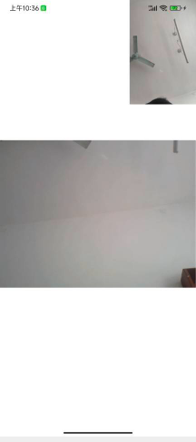

此项目是我学习netty  webrtc websocket 的一个demo  主要实现的功能为视频通话和即时通讯
目前已经实现 浏览器端和浏览器端视频通话、浏览器端和手机端视频通话(ios端我没有测试因为没有苹果手机)、手机端和手机端视频通话
## 系统模块

~~~IVCO0M@B)Z8F7FG%5D2.png)
mushan
├── mushan-im         //后端服务
├── mushan-im-web    // web端前端
├── mushan-im-app    // app端
~~~
在后端服务中sql目录为sql文件所在地，数据库是mysql 其中账号密码都是采用明文形式。
此项目主要是用作学习 可能会有一些问题  可以通过邮件跟我反馈，app端需要有相机和录音的权限不然视频通话功能无法使用。
目前只支持局域网  如果视频通话需要在外网的话 可以自己搭建turn服务器。
## b站地址
b站地址:https://www.bilibili.com/video/BV12v4y1j7dW/?spm_id_from=333.1007.top_right_bar_window_default_collection.content.click&vd_source=c6700092758092817e6a6463360a3597
## 演示效果

9I4$IFZIM8%5B45.png)

